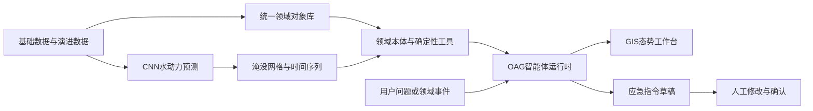
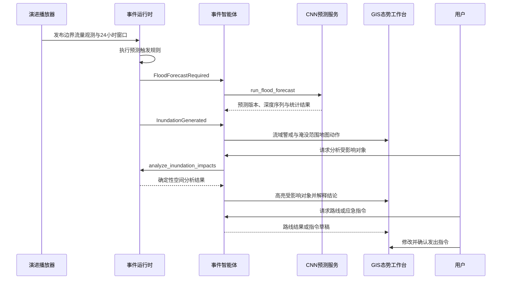
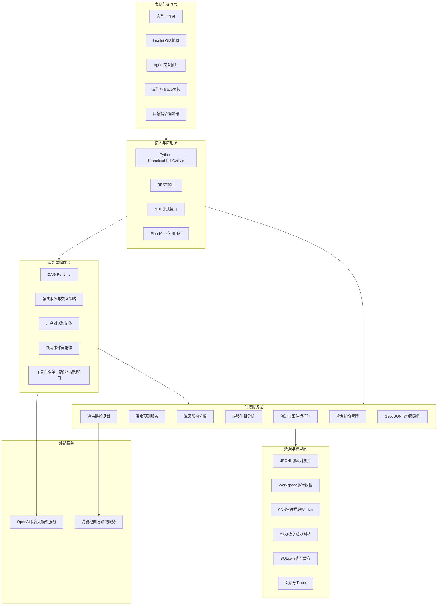

# 基于大模型的水路联动应急智能体集群应用技术方案

> 文档版本：V0.1（初稿）  
> 编制日期：2026年7月30日  
> 适用范围：珊瑚河流域洪水演进、预测、影响研判与水路联动应急处置演示系统  
> 代码基线：`main` 分支，`f129587`

## 1. 项目概述

### 1.1 建设背景

流域洪涝应急处置通常涉及水雨情监测、水库及河道调度、水动力预测、道路桥梁通行研判、人员转移、安置点选择和指令下达等多个专业环节。传统系统往往按专业分散建设，水情数据、交通对象、应急资源与预测成果之间缺少统一语义和联动机制，导致业务人员需要在多个系统之间人工切换、比对和解释。

本项目面向珊瑚河流域洪水应急演示场景，以GIS态势工作台为主要交互载体，将流域基础对象、演进过程数据、CNN水动力预测、淹没影响分析、避洪路线规划和大模型智能体交互组织在统一运行工作空间中，形成“观测—预测—研判—展示—处置—追溯”的水路联动闭环。

### 1.2 建设目标

本项目的主要目标如下：

1. 建立覆盖流域、水利工程、道路桥梁、重要设施、转移单元和安置点的统一领域对象库。
2. 通过演进数据驱动水情过程，以确定性规则识别需要运行洪水预测的业务时刻。
3. 接入CNN水动力模型，生成未来24小时多时刻淹没深度预测。
4. 将预测淹没结果与道路、桥梁、设施及避洪对象进行GIS空间关联，形成可解释的影响研判结果。
5. 通过大模型智能体理解用户意图、编排专业工具、解释结果并控制地图展示，但不允许大模型替代专业模型进行数值计算。
6. 通过应急指令草稿、人工编辑确认和已发指令留痕，实现人在回路的应急处置闭环。
7. 为后续接入实时监测数据、正式业务系统和生产级基础设施保留清晰的扩展边界。

### 1.3 系统定位与边界

当前系统定位为面向技术验证和项目演示的应用原型，重点验证大模型智能体、洪水预测模型、GIS空间分析和水路联动处置的协同方式。

当前边界包括：

- 演进过程由版本化CSV数据驱动，属于Mock演进数据，不等同于生产环境实时监测数据。
- 水动力预测由已训练的CNN模型完成，模型结论用于演示和技术验证，不替代法定预报、调度命令或现场核查。
- 部分对象几何和道路信息使用OSM、高德等第三方数据进行补充，正式业务应用前需由权威数据源复核。
- 大模型负责事件理解、工具选择、结果解释和交互编排；预测值、空间影响和路线安全性必须来自确定性模型或业务函数。
- 应急指令必须由用户检查并确认后发出，智能体无权直接完成最终指令下达。

### 1.4 总体技术路线

项目采用“领域本体统一语义、专业模型提供计算、智能体完成编排、GIS呈现态势、人工确认处置”的技术路线：



## 2. 业务场景与业务闭环

### 2.1 主要用户

- 防汛指挥和应急管理人员：查看洪水演进、预测态势和应急建议。
- 水利专业人员：关注水库、流量边界、水位和预测过程。
- 交通保障人员：研判道路、桥梁和转移路线受淹风险。
- 基层转移组织人员：查看转移单元、安置点和最晚安全转移时间。
- 系统演示与技术人员：观察智能体推理、工具调用、事件状态和模型执行过程。

### 2.2 核心业务场景

1. **态势演进**：按时间推进边界流量、降雨、库水位等过程，展示当前演进时间和关键监测摘要。
2. **预测触发**：根据当前至未来24小时流量窗口判断是否需要运行洪水预测。
3. **洪水预测**：调用CNN模型生成多时刻水深序列、最大水深包络和预测统计信息。
4. **淹没展示**：在地图上加载水动力网格和预测淹没范围，并通过预测时间轴切换时刻。
5. **影响研判**：按用户要求分析道路、桥梁、设施、转移对象和安置点是否受到淹水影响。
6. **避洪决策**：结合预测时刻和禁行水深筛选安全路线，计算最晚转移时间。
7. **智能问答**：通过自然语言查询领域对象、预测结果和业务结论，并联动地图。
8. **指令处置**：智能体形成可编辑指令草稿，用户修改、确认并发出，系统保存指令状态和关联演进版本。

### 2.3 核心业务流程



## 3. 基础数据集与数据治理

### 3.1 数据分类

系统数据分为五类：

1. **原始业务资料**：用于构建对象库的珊瑚河基础资料，存放于本地源数据目录，不直接参与日常运行。
2. **静态领域对象库**：经标准化处理后的JSONL对象，是地图、查询和空间分析的基础。
3. **演进输入数据**：驱动演进过程和预测触发的时间序列数据。
4. **模型与网格数据**：CNN权重、水动力计算网格、模型配置和归一化参数。
5. **运行派生数据**：演进工作空间内生成的观测、预测、路线、指令、事件和缓存。

### 3.2 静态领域对象库

对象库位于 `domains/flood/data/objects/`，采用一行一个对象的JSONL格式。当前共包含16类、1666条静态对象记录。

| 对象类型 | 中文名称 | 数量 | 主要内容与用途 |
|---|---:|---:|---|
| `Watershed` | 珊瑚河流域 | 1 | 流域空间范围、地图初始视野和流域警戒边界 |
| `River` | 珊瑚河 | 1 | 河道中心线及水系关联 |
| `Reservoir` | 水库 | 1 | 水库工程属性、水位和泄流业务关联 |
| `Sluice` | 水闸 | 1 | 水闸位置和工程参数 |
| `HydraulicStructure` | 其他水利工程 | 20 | 河道沿线水利工程与断面设施 |
| `HydrodynamicBoundary` | 水动力边界 | 286 | 上游、区间、支流和下游水位边界及断面 |
| `County` | 县级行政区 | 3 | 行政责任与统计范围 |
| `Town` | 乡镇 | 7 | 人口、GDP、产业和财产暴露信息 |
| `Road` | 道路 | 423 | 路网几何、等级、桥隧和单行属性 |
| `Bridge` | 桥梁 | 22 | 桥梁点位、长度、宽度和桥面高程等属性 |
| `Facility` | 重要设施 | 106 | 57所学校、35所医院和14个政府机构 |
| `Station` | 测站 | 32 | 13个山洪站、12个气象站、6个水文站和1个水库站 |
| `DangerArea` | 危险区 | 24 | 危险区位置、类型、证据和建议措施 |
| `EvacuationUnit` | 转移单元 | 10 | 转移对象、人口和关联乡镇 |
| `EvacuationSite` | 安置地点 | 719 | 709个原地安置点和10个集中安置点 |
| `EvacuationRoute` | 转移路线 | 10 | 转移单元到安置地点的基础路线 |

对象库统一保存稳定ID、名称、几何、几何类型、坐标系和数据来源信息。不同类型还具有各自业务属性，例如道路等级、桥梁高程、安置容量、转移人口和测站类型。

### 3.3 数据来源与溯源

当前数据来源包括：

- 珊瑚河业务资料及其结构化整理结果。
- OSM道路、桥梁、设施和水体等外部数据快照。
- 高德地图标准几何或在线路线规划结果。
- 系统构建脚本生成、匹配或修正的派生对象。

对象中通过以下字段保留溯源信息：

- `data_path`、`source_name`、`source_record_ids`：原始数据路径和记录标识。
- `geometry_source`、`geometry_crs`、`source_crs`：几何来源及转换前后坐标系。
- `name_source`：规范名称的生成或校正方式。
- `osm_ref`、`osm_tags`、`osm_match_status`、`osm_distance_m`：OSM匹配证据。
- `data_quality`、`coordinate_quality`、`evidence`：数据质量和业务证据。

正式业务部署时，应增加数据责任单位、采集时间、更新频率、版本号、审核状态和保密级别等治理字段。

### 3.4 演进过程数据

默认演进数据位于 `domains/flood/data/mock/boundary_flow.csv`，共545个小时级时刻，时间范围为2024年12月29日01:00至2025年1月20日17:00。

| 字段 | 含义 | 当前数据范围 |
|---|---|---:|
| `time_period_end` | 演进时刻 | 小时级时间戳 |
| `rainfall_mm` | 时段降雨量 | 0～33.6 mm |
| `interval1_outlet_flow_m3s` | 区间1出口流量 | 0.238～116.717 m³/s |
| `interval2_outlet_flow_m3s` | 区间2出口流量 | 0.033～16.439 m³/s |
| `reservoir_outlet_flow_m3s` | 水库出口流量 | 0.211～161.917 m³/s |
| `release_m3s` | 水库泄流量 | 0.214～161.917 m³/s |
| `end_level_m` | 时段末库水位 | 245.1～245.3 m |

运行时将原始字段转换为坝址、区间1、区间2和同古河四个模型边界流量，同时生成当前观测、站点雨量、24小时流量窗口、水库水位窗口和预测触发信息。

系统支持上传符合约束的新CSV演进数据源，也可通过 `FLOOD_BOUNDARY_FLOW_CSV` 指定外部文件。当前页面和技术文档必须将该时间明确称为“演进过程当前时间”，避免与系统当前时间、预测生成时间和预测有效时间混淆。

### 3.5 水动力模型数据

CNN水动力模型位于 `domains/flood/model/cnn_v2/`，主要资产包括：

| 文件或数据 | 作用 |
|---|---|
| `CNN_V2.py` | 模型结构、训练和推理入口 |
| `CNN_V2_worker.py` | 常驻推理Worker，保持模型和网格常驻内存 |
| `GT.txt` | 水动力网格定义 |
| `FLOOD_CNN.pth` | Git LFS管理的模型权重 |
| `FLOOD_CNN.json` | 模型配置、归一化状态和元数据 |
| `TIME.txt` | 历史窗口、输入和输出时间间隔 |
| `EPSG.txt` | 模型坐标系，当前为EPSG:4546 |

模型关键规模和参数如下：

- 模型边界数量：4。
- 每个边界历史流量窗口：24个小时级值。
- 输入维度：97，即 `4 × 24` 个流量特征加1个预测时刻特征。
- 输出网格单元数：571963。
- 输出时间间隔：0.5小时。
- 预测业务窗口：未来24小时。
- 卷积通道：16、32、64。
- 全连接层：128、64。
- Dropout：0.2。
- 模型水深阈值：0.05 m，低于阈值的模型结果归零。

模型采用一维卷积提取边界流量历史特征，之后通过共享特征层和概率、水深双输出头生成每个网格单元的预测值。推理结果保存为多时刻水深数组、时间步文件和最大水深结果，用于地图时间轴与最大包络展示。

### 3.6 运行派生数据

每次开始演进时创建独立Workspace，目录名形如 `run_YYYYMMDDThhmmssZ_xxxxxxxx`。主要内容包括：

| 数据 | 典型路径 | 说明 |
|---|---|---|
| Workspace元数据 | `manifest.json` | 演进ID、创建时间和状态 |
| 边界流量观测 | `boundary_flows/observations/latest.jsonl` | 当前演进的逐时观测 |
| 预测输入快照 | `boundary_flows/forecast_inputs/` | 与事件绑定的稳定输入版本 |
| 预测归档 | `forecasts/vNNN/` | 每次成功预测的独立版本 |
| 最新预测指针 | `forecasts/latest.json` | 指向当前最新预测版本 |
| 深度时间序列 | `depth_series.npy`、`time_steps.json` | 多时刻网格水深 |
| 最大水深结果 | `max_depth.csv` | 预测期最大水深包络 |
| 动态避洪路线 | `routes/current.jsonl` | 路线规划生成的路线对象 |
| 已发指令 | `directives/issued.jsonl` | 追加写入的应急指令记录 |
| 事件时间线 | `timeline.jsonl` | 观测、事件和智能体输出记录 |

共享且可重建的缓存位于 `local/runtime/flood/cache/`，包括CNN网格缓存和水动力网格SQLite索引。智能体会话与Trace默认保存在 `.oag_data/`。

### 3.7 坐标系统与空间数据规范

系统涉及三类主要坐标：

- 领域对象和对外GeoJSON统一使用WGS84/EPSG:4326。
- 高德底图和路线接口使用GCJ-02，路线结果进入对象库前转换为WGS84。
- CNN水动力原始网格采用EPSG:4546，构建地图索引时转换为WGS84。

前端使用适配高德底图的Leaflet CRS，水动力切片接口可按WGS84或GCJ-02瓦片边界查询。所有空间分析均应在明确坐标语义后执行，禁止直接混用不同坐标系的几何。

### 3.8 数据质量控制建议

当前已实现对象数量校验、稳定ID、几何存在性、坐标转换和部分外部数据匹配记录。后续建议增加：

1. 对象ID唯一性、必填字段、几何合法性和坐标范围自动校验。
2. 道路断裂、重复线、桥梁与河道偏移等拓扑质量检查。
3. 安置点容量、转移人口和路线关联关系的一致性检查。
4. 数据来源、版本、审核人和审核时间的治理台账。
5. 对 `unknown` 风险等级、缺失桥面高程等数据质量问题建立显式提示。
6. 对第三方地图数据设置更新周期和人工复核流程。

## 4. 系统总体架构

### 4.1 逻辑架构



### 4.2 分层职责

#### 表现与交互层

采用HTML、CSS和原生JavaScript构建单页态势工作台，以Leaflet承载地图。主要负责地图图层、对象Popup、演进控制、预测时间轴、态势摘要、智能体对话、Trace展示和指令编辑。

#### 接入与应用层

采用Python `ThreadingHTTPServer` 提供静态资源、REST接口和SSE流式接口。`FloodApp` 作为稳定应用门面，对HTTP层屏蔽本体加载、领域仓库、智能体和专业服务的具体实现。

#### 智能体编排层

OAG Runtime加载 `ontology.yaml`，构建领域对象、函数、事件策略和展示工具。大模型通过OpenAI兼容接口接入，在限定工具和轮次范围内完成自然语言理解与工具编排。

#### 领域服务层

以确定性Python模块实现演进、预测、影响分析、转移时机、路线规划、地图输出和应急指令管理。所有可验证的业务事实均由该层产生。

#### 数据与模型层

保存静态对象库、演进Workspace、模型权重、预测时间序列、空间索引和智能体Trace。当前以本地文件和SQLite为主，适合单机Demo部署。

### 4.3 智能体集群的实现形态

本系统中的“智能体集群”当前属于逻辑智能体集群，而非多个独立部署的LLM微服务。统一OAG Runtime根据交互来源和领域策略形成不同角色：

| 逻辑角色 | 触发方式 | 主要职责 | 工具边界 |
|---|---|---|---|
| 用户对话智能体 | 用户自然语言问题 | 对象查询、影响研判、路线规划、地图联动和结果解释 | 按用户意图选择领域工具和展示工具 |
| 洪水预测事件智能体 | `FloodForecastRequired` | 判断事件上下文并实际调用预测模型 | 只允许查询和 `run_flood_forecast` 等白名单工具 |
| 淹没结果事件智能体 | `InundationGenerated` | 判断预测期是否存在淹没并表达流域警戒 | 只允许警戒和预测结果展示工具 |
| 应急处置协同角色 | 用户明确要求形成指令 | 依据已核实事实生成指令草稿 | 只能打开草稿编辑器，不能直接发出 |

这种实现共享本体、工具、会话和审计能力，避免多套Prompt和业务规则漂移。未来如需扩大吞吐量，可将事件智能体、用户对话智能体和模型服务拆分为独立进程或服务。

## 5. 领域本体与智能体设计

### 5.1 领域本体

领域本体位于 `domains/flood/ontology.yaml`，当前定义20类对象。除16类静态对象外，还包括：

- `FloodForecast`：洪水预测及版本信息。
- `InundationForecastCell`：带预测水深和风险属性的淹没单元。
- `HydrodynamicGridCell`：57万级基础水动力网格。
- `EmergencyDirective`：应急指令领域对象。

本体为每类对象定义中文显示名、别名、数据源、ID字段、属性及面向智能体的使用说明，解决代码对象名、中文业务术语和用户自然语言之间的映射问题。

### 5.2 业务函数

当前注册5个核心业务函数：

| 函数 | 作用 |
|---|---|
| `run_flood_forecast` | 运行或读取最新洪水预测 |
| `run_emergency_cycle` | 执行观测—预测—告警—调度闭环原型 |
| `analyze_inundation_impacts` | 分析淹没范围对道路、桥梁、设施和转移对象的影响 |
| `analyze_latest_evacuation_time` | 基于24小时水深序列计算最晚安全转移时间 |
| `plan_evacuation_route` | 按预测时刻和禁行水深规划避洪路线 |

业务函数返回结构化结果，智能体负责解释结果，不得自行替代函数计算对象级结论。

### 5.3 前端展示工具

当前定义6个声明式展示工具：

- `ui_show_objects`：显示或高亮领域对象。
- `ui_clear_map`：清除淹没结果或重置地图。
- `ui_set_inundation_alert`：设置或清除流域预测警戒。
- `ui_focus_object`：定位、缩放并打开对象Popup。
- `ui_show_event_marker`：显示带明确坐标的事件。
- `ui_open_emergency_directive_editor`：打开指令草稿编辑器。

展示工具只返回声明式前端动作，不直接操作浏览器DOM，也不修改领域数据。服务端通过工具结果Hook将其转换为SSE事件，由前端统一执行。

### 5.4 Prompt与工具约束

OAG采用分层Prompt：领域身份、对象和函数摘要、通用工具规则、交互策略、动态运行上下文和当前GIS状态分别装配。完整对象定义按需通过工具读取，避免把全部本体放入每轮上下文。

主要约束包括：

- 用户明确要求显示、定位或清理地图时，必须调用相应 `ui_*` 工具。
- 对象级淹没影响必须调用 `analyze_inundation_impacts`。
- 最晚转移时间必须调用 `analyze_latest_evacuation_time`。
- 路线规划必须调用 `plan_evacuation_route`，不得在无安全路线后擅自变更业务条件重试。
- 预测请求事件必须调用 `run_flood_forecast`；未调用时事件结果被拒绝并标记失败。
- 预测结果生成事件只负责淹没警戒和范围展示，不自动执行对象影响分析。
- 指令工具只生成草稿，最终发出必须经过用户确认。

### 5.5 会话、Trace与错误守门

用户会话按Workspace和前端会话ID隔离。智能体流式输出包括文本、Reasoning、工具调用、工具结果、地图动作和确认事件。OAG记录会话与Trace，并对工具参数、执行超时、最大轮次、工具错误和未恢复失败进行统一控制。

事件智能体还会校验预测结果的Workspace和预测输入版本，防止旧演进或错误输入的预测结果被接入当前事件链。

## 6. 核心技术实现

### 6.1 对象库构建与查询

对象构建脚本将原始表格、矢量数据、OSM快照和高德几何转换为规范JSONL。运行时Repository按对象类型装载数据，通过稳定ID、属性过滤、数量统计和关键词搜索向智能体及HTTP服务提供统一查询能力。

大型几何在普通智能体查询结果中会被压缩为 `geometry_available` 标记，避免把完整坐标串写入大模型上下文；地图展示仍通过专用GeoJSON接口读取完整几何。

### 6.2 演进播放器

演进运行时逐行读取边界流量CSV并生成结构化观测。每个观测包含演进时间、降雨、库水位、四边界流量、总流量和未来24小时窗口。

预测触发规则当前使用24小时窗口总流量阈值230 m³/s。达到条件时生成稳定的预测输入快照和 `FloodForecastRequired` 事件。演进支持开始、暂停、继续、单步、重置、倍速和自动暂停，速率可选1×、2×、5×、10×和20×。

### 6.3 事件驱动运行时

`EventRuntime` 负责演进线程、事件队列、事件代次、SSE输出和子事件发布。事件使用 `event_id`、`correlation_id`、`workspace_id` 和 `source_id` 关联完整链路。

主要状态过程如下：

```text
边界流量观测
  └─ 达到触发条件 → FloodForecastRequired
       ├─ 预测成功 → InundationGenerated
       │    └─ 设置流域警戒并展示预测结果
       └─ 未调用工具或预测失败 → 标记失败，后续时刻可重试
```

事件运行时与智能体处理器分离：前者拥有并发、队列和发布权，后者只负责事件解释、受限工具调用和结果上报。

### 6.4 CNN水动力预测

预测服务将事件对应的25点边界流量窗口转换为模型输入文件，调用常驻CNN Worker生成0～24小时水深序列。常驻Worker在服务生命周期内保持权重和网格常驻内存，避免每次预测重复加载数GB模型状态。

预测流程包括：

1. 校验当前Workspace和预测输入快照。
2. 生成模型所需的四边界时间序列。
3. 通过JSON Lines协议向Worker提交推理请求。
4. 读取并校验模型输出形状、时间步和网格数量。
5. 保存 `depth_series.npy`、`time_steps.json` 和 `max_depth.csv`。
6. 计算淹没单元数、最大水深、淹没面积和执行耗时。
7. 创建 `vNNN` 预测归档并原子更新 `latest.json`。
8. 成功后清理临时输入输出目录，失败时保留现场用于诊断。

默认推理超时300秒、批大小8、设备为CPU，可通过环境变量切换CPU、CUDA或MPS。

### 6.5 水动力网格索引与地图渲染

直接将571963个网格多边形一次性转换成GeoJSON会造成较高的服务端序列化、网络传输和浏览器渲染成本。因此系统采用分级优化：

- 首次运行时从 `GT.txt` 构建共享 `mesh.sqlite`。
- SQLite保存三角形几何、包围盒和13～15级瓦片索引。
- 前端根据当前地图范围按瓦片请求网格，不一次加载全量网格。
- 淹没展示只查询有正水深的单元，并使用紧凑数组传输坐标与水深。
- 深度结果采用最多8项的内存LRU缓存，湿网格瓦片采用最多1024项的LRU缓存。
- 重复并发读取同一深度结果时合并加载，避免重复I/O。
- 时间轴切换按 `time_h` 读取最近预测切片，最大态使用最大水深包络。

前端将网格绘制与对象图层分离，支持时间轴拖动、播放和按预测时刻刷新。淹没图层刷新不自动改变用户当前地图视野。

### 6.6 淹没影响分析

影响分析支持设施、桥梁、转移单元、安置点、道路和转移路线。默认最小分析水深为0.15 m，普通对象最大匹配距离为10 m，桥梁影响半径为80 m。

判定方式包括：

- 点对象：按对象坐标匹配最近淹没网格。
- 道路和路线：对线几何采样，匹配命中的最深网格。
- 桥梁：对桥位周边完整网格多边形进行桥头影响区分析；当河道两侧桥头均受影响时判为大概率无法通行。

桥梁缺少可靠桥面高程时，系统明确返回 `insufficient_bridge_elevation`，使用邻近洪泛区水深作为风险证据，而不声称桥面本体已被直接淹没。

风险等级依据水深和流速组合确定：

- `critical`：水深不低于1.6 m，或水深与流速乘积不低于1.2。
- `high`：水深不低于0.9 m，或水深与流速乘积不低于0.55。
- `medium`：水深不低于0.35 m。
- `low`：其他达到分析阈值的情况。

分析可针对最大水深包络，也可指定预测 `time_h`。返回结果同时包含 `valid_from`、`analysis_time_at` 等绝对时间，避免把相对预测时刻误解为钟表时间。

### 6.7 最晚安全转移时间

最晚转移分析读取完整24小时水深序列，将转移单元起点、路线和安置点附近网格与各预测时刻对齐。系统以最后一个被模型明确确认安全的时间片为依据，不在两个时间片之间自行插值，从而保持结果确定、保守和可复核。

默认道路阻断水深为0.30 m。系统综合路线长度、默认步行速度、用户指定清空时长和安全缓冲时间，给出首次不安全时刻、最后确认安全完成时刻和最晚出发时刻。若预测序列不足24小时，则拒绝形成24小时最晚转移结论。

### 6.8 避洪路线规划

路线规划使用高德Web服务获取驾车或步行候选路线，之后在本地进行洪水安全校验：

1. 将WGS84起终点转换为GCJ-02后请求高德路线。
2. 将返回路线转换回WGS84。
3. 检查路线端点与领域对象位置的距离。
4. 将路线与指定预测时刻达到禁行水深的网格相交。
5. 从安全候选中选择距离最短路线。
6. 所有候选均不安全时返回 `no_safe_route`，不保存违反洪水约束的路线。

默认驾车禁行水深为0.30 m，步行禁行水深为0.15 m；最大端点距离800 m，最大绕行倍率10。动态规划结果以 `EvacuationRoute` 对象写入当前Workspace。

### 6.9 应急指令管理

用户明确要求形成指令时，智能体根据已核实事实生成标题、接收对象、优先级和正文，并打开前端编辑器。用户可继续修改内容，确认后通过服务端接口发出。

服务端校验当前Workspace、必填字段、长度和优先级，生成 `DIR-YYYYMMDD-NNN` 编号并追加写入 `issued.jsonl`。记录包含演进时间、预测版本和发出时间。已经发出的指令使用只读编辑器查看，避免误认为仍可修改历史记录。

### 6.10 前端态势工作台

前端采用单页原生Web实现，主要区域包括：

- 透明启动封面和系统介绍。
- 珊瑚河流域GIS地图及对象图层控制。
- 多对象Popup，支持用户分别关闭。
- 演进状态、演进时间和控制按钮。
- 预测时间轴、预测时刻状态和淹没图例。
- 受影响对象面板和态势摘要。
- 智能体对话、Reasoning、工具Trace和结果卡片。
- 应急指令列表、草稿编辑器和已发指令只读查看。

封面状态与工作台状态使用不同地图视野：封面将流域完整放在右侧作为真实主视觉，进入工作台后流域回到地图中心并放大四分之一级。

## 7. 接口设计

### 7.1 接口风格

系统使用JSON REST接口完成状态查询和命令操作，使用SSE完成智能体与演进事件的增量推送。SSE避免前端频繁轮询，同时适合传输文本、Reasoning、工具调用、地图动作和演进状态等异构事件。

### 7.2 主要接口

| 方法 | 路径 | 作用 |
|---|---|---|
| GET | `/api/bootstrap` | 获取系统标题、本体对象和初始化配置 |
| GET | `/api/agent/chat/stream` | 发起或续接智能体流式会话 |
| GET | `/api/agent/runs/active` | 查询当前会话活动任务 |
| POST | `/api/agent/runs/{id}/cancel` | 取消智能体任务 |
| POST | `/api/agent/confirm` | 确认工具或回答智能体追问 |
| GET | `/api/autonomy/stream` | 订阅演进、事件和智能体Trace |
| GET | `/api/autonomy/status` | 查询演进状态 |
| POST | `/api/autonomy/start` | 开始演进 |
| POST | `/api/autonomy/pause` | 暂停演进 |
| POST | `/api/autonomy/resume` | 继续演进 |
| POST | `/api/autonomy/step` | 单步演进 |
| POST | `/api/autonomy/speed` | 调整演进倍速 |
| POST | `/api/autonomy/reset` | 重置并新建演进Workspace |
| GET/POST | `/api/autonomy/sources` | 查询或上传演进数据源 |
| GET | `/api/geojson` | 查询领域对象GeoJSON |
| GET | `/api/object` | 查询单个对象详情 |
| GET | `/api/hydrodynamic-grid/meta` | 查询水动力网格和预测元数据 |
| GET | `/api/hydrodynamic-grid/tile` | 按瓦片和预测时刻查询网格 |
| GET | `/api/impact-analysis` | 查询确定性淹没影响分析结果 |
| GET/POST | `/api/directives` | 查询已发指令或确认发出新指令 |

### 7.3 地图动作协议

智能体地图工具输出统一的 `map_actions` 结构，包括对象类型、过滤条件、对象ID、高亮、缩放、刷新和清理等动作。前端只执行白名单动作，不解析或执行大模型直接生成的JavaScript。

## 8. 状态、版本与一致性设计

### 8.1 Workspace隔离

每次新演进创建独立Workspace，观测、预测、路线和指令均绑定 `workspace_id`。重置演进后，旧Workspace保留用于追溯，但不再作为当前运行状态。

### 8.2 预测版本

每次成功预测归档为 `vNNN`，`latest.json` 只保存当前指针。地图、影响分析和路线规划既可使用 `latest`，也可明确指定版本。

### 8.3 时间语义

系统区分以下时间：

- **系统时间**：服务器和浏览器实际时间。
- **演进过程当前时间**：当前播放到的Mock或外部数据时刻。
- **预测生成时间**：模型完成计算并保存结果的时间。
- **预测基准时间 `valid_from`**：预测相对时间的起点。
- **预测时刻 `time_h`**：相对 `valid_from` 的小时偏移。
- **预测有效时刻 `valid_at`**：`valid_from + time_h` 的绝对时间。
- **指令发出时间**：用户确认发出指令的系统时间。

前端态势摘要分别展示演进状态和预测状态，避免把两类时间拼接为一句难以理解的文本。

### 8.4 并发与原子性

- Workspace活动指针、预测指针和关键JSON文件采用临时文件替换方式原子写入。
- 动态路线和指令使用进程内锁保护追加或重写。
- 预测输入在事件产生时形成快照，避免演进继续推进后模型读取到不同输入。
- 事件代次用于丢弃重置前仍在执行的旧事件结果。
- 同一预测输入记录开始、完成和失败状态，允许后续预测时刻按规则重试。

## 9. 非功能设计

### 9.1 性能

当前性能设计包括：

- CNN模型和网格常驻Worker，减少重复初始化。
- 水动力网格SQLite预索引和瓦片化加载。
- 深度与瓦片LRU缓存。
- GeoJSON结果缓存及按需简化。
- 大模型查询结果剔除大型几何。
- SSE增量推送，避免整页状态轮询。
- 前端淹没图层按预测时刻增量切换，并中止过期请求。

后续应建立预测耗时、瓦片响应时间、首屏时间、SSE积压和大模型调用耗时等量化指标。

### 9.2 可靠性

- 专业工具错误不会被大模型最终文本掩盖。
- 预测事件未调用必需工具时直接拒绝结果并标记失败。
- 预测结果校验Workspace和输入版本。
- 无安全路线时返回明确状态，不保存不安全路线。
- 多时刻预测不完整时不生成最晚转移结论。
- 失败预测保留临时输入输出，便于问题定位。
- systemd可配置服务异常自动重启。

### 9.3 安全

当前敏感配置通过 `.env` 管理，不进入Git，主要包括大模型API地址、密钥和高德服务密钥。地图展示工具采用声明式白名单动作，应急指令采用人工确认。

当前Demo服务尚未实现完整的用户认证、权限控制和传输加密。生产化部署应增加：

1. HTTPS和反向代理。
2. 统一身份认证和基于角色的权限控制。
3. 指令发出、数据上传和演进控制的操作审计。
4. 密钥托管与定期轮换。
5. 文件上传类型、大小、内容和病毒检查。
6. 外部大模型的数据脱敏、调用范围和留存策略。

### 9.4 可维护性

系统将HTTP、聊天、事件、展示动作、领域运行时和模型适配器拆分为独立模块。领域名称、工具策略和事件规则集中定义在本体中，减少Prompt、前端文案和后端规则多处重复。

静态数据清单、模型元数据和关键参数均有版本化文件，便于自动生成附录并进行持续一致性检查。

### 9.5 可观测与审计

当前可观察内容包括：

- 智能体Reasoning、工具调用和工具结果Trace。
- 演进观测、领域事件和子事件时间线。
- 预测执行状态、模型耗时和结果统计。
- Workspace、预测版本和指令记录。
- 服务标准输出和systemd日志。

生产化阶段建议接入结构化日志、Prometheus指标、集中Trace检索和告警平台。

## 10. 部署与运行方案

### 10.1 基础环境

- Python 3.11及以上版本。
- `uv` 依赖和虚拟环境管理工具。
- Git与Git LFS，用于获取代码、子模块和CNN权重。
- CPU运行环境；有条件时可配置CUDA或MPS。
- 可访问OpenAI兼容大模型服务和高德Web服务。

### 10.2 关键依赖

- `numpy`：水深时间序列与网格计算。
- `torch`：CNN模型推理。
- `oag`：本体驱动智能体运行时，当前以Git子模块方式接入。
- Leaflet：Web GIS地图和图层管理。
- Lucide：界面图标。
- Marked：智能体Markdown文本渲染。

### 10.3 环境配置

| 变量 | 说明 | 默认值或要求 |
|---|---|---|
| `LLM_API_URL` | OpenAI兼容接口地址 | 启用智能体时必填 |
| `LLM_API_KEY` | 大模型接口密钥 | 启用智能体时必填 |
| `LLM_MODEL` | 模型名称 | 启用智能体时必填 |
| `LLM_DISABLE_REASONING` | 是否关闭模型Thinking输出 | 默认可配置 |
| `AMAP_WEB_SERVICE_KEY` | 高德Web服务密钥 | 使用路线规划时必填 |
| `AMAP_TIMEOUT_SECONDS` | 高德请求超时 | 20秒 |
| `FLOOD_AGENT_MAX_TURNS` | 智能体最大轮次 | 默认10，最大20 |
| `FLOOD_CNN_TIMEOUT_SECONDS` | CNN推理超时 | 300秒 |
| `FLOOD_CNN_DEVICE` | 推理设备 | `cpu` |
| `FLOOD_CNN_PERSISTENT_WORKER` | 是否启用常驻Worker | `true` |
| `FLOOD_CNN_BATCH_SIZE` | 推理批大小 | 8 |
| `FLOOD_WORKSPACE_RETENTION_COUNT` | 自动保留Workspace数量 | 0表示不自动清理 |
| `FLOOD_BOUNDARY_FLOW_CSV` | 外部演进CSV路径 | 默认使用仓库Mock数据 |

### 10.4 启动方式

```bash
git submodule update --init --recursive
git lfs pull
uv sync
uv run python scripts/check_runtime.py --profile full
uv run python server/app.py --host 0.0.0.0 --port 8765
```

正式演示环境建议使用systemd用户服务托管，指定项目工作目录和虚拟环境Python，并配置异常自动重启。更新时使用 `rsync` 同步版本文件，保留远端 `.env`、虚拟环境和 `local/runtime` 运行数据，然后重启服务并执行HTTP健康检查。

### 10.5 生产化部署演进

当前单机部署适合Demo。生产化可逐步演进为：

- Nginx或网关负责HTTPS、认证和静态资源缓存。
- API服务、事件Worker、智能体Worker和CNN模型服务独立部署。
- PostgreSQL/PostGIS保存领域对象和空间索引。
- 对象存储保存模型、预测数组和历史归档。
- Redis或消息队列承载事件分发、任务状态和分布式锁。
- 监控平台统一采集日志、指标和调用链。

## 11. 测试与验证

### 11.1 当前测试范围

项目自动化测试覆盖：

- 对象库完整性和流域几何。
- 高德投影和坐标转换。
- 边界流量播放、预测窗口与事件触发。
- CNN适配器、预测存储和网格缓存。
- GeoJSON和地图动作。
- 淹没影响、桥梁影响和路线规划。
- 最晚转移时间。
- 水库监测、演进Workspace和回放数据源。
- 智能体聊天服务、事件运行时和应急指令。
- 页面标题、封面、时间轴、只读指令和静态资源契约。

### 11.2 验证命令

```bash
uv run python -m unittest discover -s tests -q
uv run pytest agent/tests -q
node --check server/static/app.js
```

### 11.3 建议增加的验收指标

- 基础对象数量和关键关联完整率。
- 演进重置、暂停、恢复和重试的一致性。
- 预测输入快照与预测版本的可追溯率。
- CNN冷启动和热启动耗时。
- 57万级网格首屏、拖动和时间轴切换性能。
- 对象影响分析与人工GIS抽查的一致率。
- 路线端点、绕行倍率和淹没相交校验通过率。
- 智能体必调工具遵从率和错误拒绝率。
- 指令未经人工确认不得发出的安全性验证。

## 12. 当前限制与后续演进

### 12.1 当前限制

1. 演进数据为Mock，不是实时水雨情接入。
2. 部分基础对象来自第三方或自动匹配，需要权威复核。
3. 危险区风险等级当前均为 `unknown`，只能依据证据字段和预测结果进一步研判。
4. 桥面高程等关键工程属性不完整，桥梁结论主要依据桥头及邻近洪泛区。
5. 高德步行接口无法直接接收自定义淹没面，只能对候选路线进行事后安全筛选。
6. 当前为单机文件型存储，不适合多实例同时写入。
7. 当前缺少正式用户认证、细粒度权限和HTTPS。
8. 逻辑智能体角色共享同一运行时，尚未形成独立部署的分布式智能体集群。

### 12.2 演进方向

#### 数据侧

- 接入实时雨量、水位、流量和水库调度数据。
- 接入权威道路、桥梁、人口和应急资源数据。
- 建立数据版本、质量评分和人工审核工作流。

#### 模型侧

- 增加模型版本管理、精度评估和不确定性表达。
- 支持不同洪水过程、模型方案和实时校正。
- 将CNN推理拆分为独立模型服务，并提供资源调度和健康检查。

#### 智能体侧

- 将用户问答、预测、影响研判、交通保障和指令协同角色拆分为可独立扩缩的智能体Worker。
- 引入任务总线和显式协作协议，同时继续以本体作为统一语义和工具契约。
- 建立Prompt、工具调用、事实引用和回答质量评测集。

#### 平台侧

- 引入PostGIS、消息队列、对象存储和统一可观测平台。
- 增加组织、用户、角色和应急预案管理。
- 支持多流域、多事件和多工作空间并行运行。

## 13. 关键参数表

| 参数 | 当前值 | 语义 |
|---|---:|---|
| 预测触发总流量 | 230 m³/s | 未来24小时窗口总边界流量触发阈值 |
| 预测窗口 | 24 h | 洪水预测与转移时间分析范围 |
| 模型输出间隔 | 0.5 h | 相邻预测切片间隔 |
| 模型水深阈值 | 0.05 m | 模型输出低于该值时归零 |
| 应用淹没单元过滤值 | 0.04 m | 构建淹没对象时的最低过滤值；因模型已执行0.05 m归零，当前实际受模型阈值约束 |
| 影响分析最小水深 | 0.15 m | 默认纳入对象影响分析的水深 |
| 普通对象匹配距离 | 10 m | 点、线对象与网格的默认空间邻近距离 |
| 桥梁影响半径 | 80 m | 桥头及邻近洪泛区分析范围 |
| 驾车禁行水深 | 0.30 m | 驾车路线安全筛选阈值 |
| 步行禁行水深 | 0.15 m | 步行路线安全筛选阈值 |
| 最大路线端点偏差 | 800 m | 高德路线与领域对象端点校验 |
| 最大绕行倍率 | 10 | 候选路线合理性校验 |
| 智能体默认最大轮次 | 10 | 单次智能体任务最大工具与生成轮次 |
| CNN默认超时 | 300 s | 单次模型推理最大等待时间 |

## 14. 结论

本项目以统一领域对象和时空数据为基础，以CNN水动力模型和GIS空间分析提供确定性专业能力，以OAG本体驱动智能体完成事件理解、工具编排和人机交互，在同一态势工作台中实现了流域洪水演进、预测淹没展示、水路影响研判、避洪路线规划和应急指令处置。

该方案的关键原则是“大模型组织专业能力，而不是替代专业能力”。所有可验证的洪水预测、空间影响和路线安全结论均由专业模型或确定性函数产生，大模型主要承担自然语言入口、过程编排、结果解释和跨业务协同。该架构既适合当前Demo展示，也为后续接入真实数据、拆分模型服务和建设生产级智能体协同平台提供了可演进基础。

